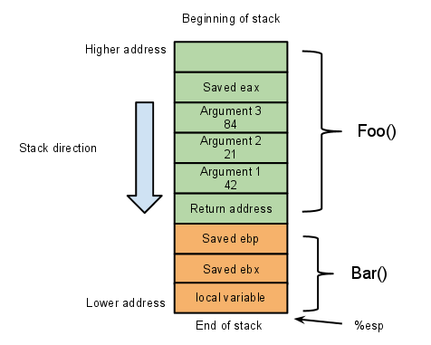

# Buffer Overflow

- Date: 12 June 2020
- Author: [roerohan](https://github.com/roerohan)

A detailed session on Computer Memory, working of Assembly Language, memory stack, [GDB](https://www.gnu.org/software/gdb/), etc.

> Note: A brief write-up is available [here](https://github.com/csivitu/CTF-Write-ups/tree/master/HSCTF%207/Binary%20Exploitation/boredom).

# Requirements

The following are the requirements for understanding / implementing this buffer overflow.

- GDB ([GNU Debugger](https://www.gnu.org/software/gdb/))
- Basic Knowledge of C Programming
- Basic Knowledge of Stacks from DSA

# Source

- The challenge was originally hosted [here](https://ctf.hsctf.com/challenges#Boredom).
- The pre-compiled binary is present [here](https://github.com/csivitu/CTF-Write-ups/blob/master/HSCTF%207/Binary%20Exploitation/boredom/boredom). 
- The [C program](https://github.com/csivitu/CTF-Write-ups/blob/master/HSCTF%207/Binary%20Exploitation/boredom/boredom.c) is as follows:

### C Program
```c
#include <stdio.h>
#include <stdlib.h>
#include <unistd.h>
#include <string.h>
#include <sys/types.h>
#include <signal.h>

void setup() {
  puts("I'm currently bored out of my mind. Give me something to do!");
  setvbuf(stdin, NULL, _IONBF, NULL);
  setvbuf(stdout, NULL, _IONBF, NULL);
}

void flag() {
  FILE *f = fopen("flag.txt", "r");
  char buf[50];
  if (f == NULL) {
    puts("You're running this locally or I can't access the flag file for some reason.");
    puts("If this occurs on the remote, ping @PMP#5728 on discord server.");
    exit(1);
  }
  fgets(buf, 50, f);
  printf("Hey, that's a neat idea. Here's a flag for your trouble: %s\n",
    buf);
  puts("Now go away.");
  exit(42);
}

int main() {
  char toDo[200];
  setup();

  printf("Give me something to do: ");
  gets(toDo);
  puts("Ehhhhh, maybe later.");
  return 0;
}
```

> Note: Use the binary provided [here](https://github.com/csivitu/CTF-Write-ups/blob/master/HSCTF%207/Binary%20Exploitation/boredom/boredom) to execute the challenge, do not compile it on your local machine.

# Challenge Description

The goal in this CTF challenge is to run the `flag()` function (of course, without changing the C program), which prints the output of `flag.txt` to `stdout`.
<br />

In the given C program, the `main()` function runs first. It calls the `setup()` function which prints the string `I'm currently bored out of my mind. Give me something to do!` using the `puts()` function. Then, it prints `Give me something to do: `, after which it takes user input and stores it into a character array named `toDo` of size 200 bytes (1 character in [ASCII](http://www.asciitable.com/) occupies 1 byte). Finally, the `puts()` function is used to print `Ehhhhh, maybe later.`.

# Concept

## Program Compilation

A C program may be compiled using:

```bash
gcc program.c -o program -fno-stack-protector

# 'program' is the name of the binary output file
# The -fno-stack-protector flag prevents detection of stack-smashing (canaries)
```

> Note: ASLR ([Address Space Layout Randomization](https://en.wikipedia.org/wiki/Address_space_layout_randomization)) needs to be turned off in case you want to compile a binary which can be subject to buffer overflow. That can be done using:

```bash
sudo bash -c 'echo 0 > /proc/sys/kernel/randomize_va_space'
```

## Assembly Language

A compiled C program generates a binary file that can be executed using `./program`. Since this is a binary file, it contains sequences of 0s and 1s, which have special meanings to the processor. These sequences converted into human-readable form is basically what [`Assembly`](https://en.wikipedia.org/wiki/Assembly_language) consists of.
<br />

Thus, assembly is a series of instructions in the following format:

```
address:  name    operator,operator

Example:

0x0000000000401261:	 mov   eax,ebx
```

Here, `eax` and `ebx` are **registers**. A register (a group of flip-flops) is the smallest, fastest storage unit in your processor. In a 64-bit PC, each register holds 64-bits. Likewise, in a 32-bit PC, a register holds 32-bits. The size of a register is called the **word length** of the PC, and a group of \<word-length\> bits is called a **word**.

### There are some important registers:

- rip: This is the instruction pointer, points to the instruction that is going to be executed next.
- rbp: The base pointer of the stack, which is referred to in the next section.
- rsp: The stack pointer of the stack, which is referred to in the next section.

> Note: These registers are called `eip`, `ebp`, `esp` in 32-bit machines.

## Computer Memory - Stack

Here, Computer Memory refers mainly to the RAM. When a program is executed, the process is loaded into the RAM. There are two parts:

1. A part of the RAM stores the assembly code.
2. Another part stores the stack.

These parts of the memory have registers dedicated to them. The assembly has the `rip` register, which points to the next instruction, and the stack has the registers `rbp` and `rsp`, which indicates the bottom and the top of the stack.
<br />

The stack is meant for storing statically defined (basically, not defined using malloc. The compiler already knows the size of these variables) local variables. Thus, every function in a program has it's own stack.
<br />


An important thing to notice about the stack is that *'the stack grows downwards'*. This basically means that the base pointer of the stacks points to a higher memory location than the stack pointer. For example, to add 208 bytes to the stack, 208 is subtracted from `rsp` (the stack pointer).


Therefore, as the stack grows, the stack pointer keeps moving downwards, i.e, the value of `rsp` keeps decreasing.
<br />

> Note: The C program [here](#c-program) is used for describing how the stack works.

It is essential to understand how the stack pointers are shifted between parts of the stack belonging to different functions to solve the challenge, and most other buffer overflow challenges. This is done in a three step process. Here's what happens when a function is called.

1. Let's say a function `setup()` is called from within `main()`. The `call` instruction is used to call a function. The `call` instruction causes the address of the next instruction in `main()` to be pushed onto the stack. Then, the `jmp` instruction causes the `rip` to point to the first line of the `setup()` function. The instruction was pushed into the stack so that the function knows where to return when it has finished execution. Hence, it is also called the `return pointer`. Notice, the stack pointer now moves one place down, since it always points to the top (here, technically the bottom) of the stack.

2. The base pointer current points to the base of `main`s stack. However, now we want to allocate a new stack for the local variables of `setup()`, since we do not want the stack of `setup` to overwrite the variables in the stack of `main`. So two allocate a new stack, the base pointer needs to be shifted. But before that, we need to store the current base pointer onto the stack so that we can recover it upon coming back to the `main` function. This is done using `push rbp`. Now, `rbp` can be make equal to `rsp`, shifting the base pointer to point to the stack pointer.

3. Finally, the size of the local variables is subtracted from `rsp`. This allocates space for storage of data. If arrays are stored in the stack, they are stored from a lower address to a higher address, i.e, the end near `rsp` stores the `0th` index and the end near `rbp` stores the `nth` index.

Now, the stack looks like: (notice the orange area)
<br />



So, when the return instruction is executed, all the variables upto the current `rbp` can be popped. The next address has the `saved rbp`, which can be popped and stored in `rbp`. Here, `rbp` is restored to the `rbp` of main. The next address indicates the return address, which is popped into the `rip`, so the instruction pointer now goes back to main. Check out [this video](https://www.youtube.com/watch?v=Q2sFmqvpBe0) for visual reference.


# Exploitation

Now that we've discussed all the concepts you need for a basic buffer overflow, we need to decide how we can use these to run the `flag()` function in the [C program](#c-program). So upon a bit of research, you will find out that there is an issue in the `gets()` function in C. It does not check if the size of the input exceeds the size of the stack allocated for the function (or the size of the local variables). We can use this vulnerability to our advantage.

### The Idea

We can write excessive characters in the input, so that it fills up all the places allocated for main and writes past the `saved rbp`. Next in the stack is the return pointer, which we can overwrite with the starting address of the `flag()` function, causing `rip` to point to the flag function, therefore executing that function. So, we can fire up GDB and see if this strategy works.

First, we find out the size of the stack allocated for the main function. We can see the assembly dump of the main function using the command `disas main`.
<br />


You see in the third line, there is an instruction to subtract `0xd0` from `rsp`: `sub rsp,0xd0`. `0xd0` in hexadecimal is `208` in integer, therefore this line allocates 208 bytes for the stack of the `main function`. (We assume that the memory is byte addressable, that is, every cell in the stack stores 1 byte.)
<br />

Now, we have to find where the return pointer is, so that we can overwrite it. From the [concept](#concept) section, we know that there is the `saved rbp` before the stack allocated for a function, before which is the return pointer. Since it is a `64 bit` binary, each register stores `64 bits` or `8 bytes`. Hence, 8 more bytes (8 places in the stack) need to be overwritten before we reach the return pointer. So, in total, we need to write **216 bytes** before we can write the address of the `flag()` function into the return pointer.
<br />

Now, for some proof of concept, you can try to execute the binary and pass in 216 random characters (1 character is 1 byte in ASCII). This will result in a segmentation fault, since the `rbp` might not hold a valid address.
<br />

However, for the target payload, we need the address of the `flag` function. So we can see the assembler dump or the `flag()` function, and get the address of the first instruction.
<br />


So, the `flag()` function begins at the address `0x00000000004011d5`. These are all hexadecimal characters, and need to be written using [little endian format](https://en.wikipedia.org/wiki/Endianness) for the final payload. Thus, all the bytes in the address need to be typed in reverse, making it `\xd5\x11\x40\x00\x00\x00\x00\x00`. The final payload can be generated using `python 2`, as shown below:

```bash
python2 -c "print 'a'*216 + '\xd5\x11\x40\x00\x00\x00\x00\x00'"
```

The output of this can be piped into the `boredom` binary, using:

```bash
python2 -c "print 'a'*216 + '\xd5\x11\x40\x00\x00\x00\x00\x00'" | ./boredom
```

This results in the following output.


Thus, the buffer overflow is successful! This strategy can be used in a malicious manner by hackers to execute sensitive functions which the user should not have access to. 

# References

- Video: https://www.youtube.com/watch?v=oS2O75H57qU
- Web Resource: https://dhavalkapil.com/blogs/Buffer-Overflow-Exploit/
